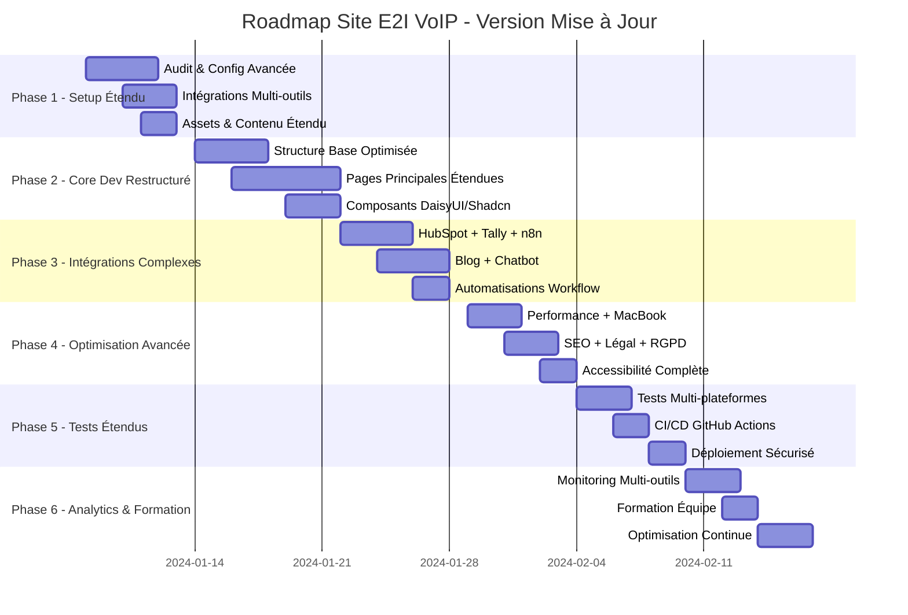

# Roadmap de développement - Site E2I VoIP

## 📅 Timeline général : 7 semaines (étendu)

## 🎯 Objectifs par sprint mis à jour

### Sprint 1 (Semaine 1) - Foundation Étendue

**Objectif** : Préparer l'environnement multi-outils et intégrations complexes

#### Jour 1-2 : Audit et Configuration Avancée

- [x] Audit du code existant
- [x] Analysis des composants actuels
- [x] Setup environnement de développement
- [x] **NOUVEAU** : Configuration DaisyUI + shadcn/ui
- [x] **NOUVEAU** : Installation Lineicons + ReactBits
- [x] Configuration optimisée pour MacBook Pro 13", 14", 15"

#### Jour 3-4 : Intégrations Multi-outils

- [x] Configuration HubSpot (CRM + Blog + Analytics) ✅
  - [x] Clé API HubSpot configurée
  - [x] Portail ID 26878201 configuré
  - [x] Script de suivi HubSpot intégré
- [x] **NOUVEAU** : Setup Tally (formulaires de devis) ✅
  - [x] Clé API Tally configurée
  - [x] 4 formulaires de devis spécialisés créés
  - [x] Webhooks Tally configurés- [x] **NOUVEAU** : Configuration n8n (automatisations) ✅
- [x] **NOUVEAU** : Setup webhooks Tally → n8n → HubSpot ✅
- [x] **NOUVEAU** : Configuration chatbot Tawk.to ✅
  - [x] Widget Tawk.to intégré (ID: 688d3cc109ef001928d4773f/1j1jrald3)
  - [x] Exclusion pages /contact et /devis-en-ligne
  - [x] Chargement dynamique selon la page
  - [x] Composant React optimisé
  - [x] Tests unitaires créés
- [x] Tests de connexions toutes intégrations

#### Jour 5 : Assets et Contenu Étendu

- [ ] Optimisation images WebP
- [ ] Collecte logos clients + partenaires
- [ ] **NOUVEAU** : Exemples audio studio d'attente
- [ ] **NOUVEAU** : Contenu légal (CGV, Confidentialité)
- [ ] **NOUVEAU** : Contenu RGPD chatbot

### Sprint 2 (Semaines 2-3) - Développement Core Restructuré

**Objectif** : Développer la structure optimisée et pages étendues

#### Semaine 2 : Structure Optimisée Multi-Device

- [ ] **Layout principal optimisé**
  - [x] Header responsive MacBook Pro optimisé
  - [x] Navigation avec breadcrumbs
  - [x] Footer avec partenaires + légal + RGPD
- [ ] **Page d'accueil modernisée**
  - [ ] Hero section nouveau design
  - [ ] Section services restructurée
  - [ ] Logos clients + partenaires
  - [ ] Témoignages optimisés
  - [ ] CTA vers formulaires Tally

#### Semaine 3 : Pages Services Étendues

- [ ] **Qui sommes-nous étendue**
  - [ ] Histoire + équipe + certifications
  - [ ] **NOUVEAU** : Section partenaires dédiée
- [ ] **Téléphonie d'entreprise restructurée**
  - [ ] Trunk SIP (compteur vs illimité)
  - [ ] 3CX PRO dédiée vs 3CX SMB mutualisée
  - [ ] **NOUVEAU** : PBX Yeastar (PME/cabinets médicaux)
  - [ ] Mobilité (MVNO + Backup 4G)
- [ ] **NOUVELLES Pages Services**
  - [ ] Studio attente (exemples audio + player)
  - [ ] Assistants vocaux IA (cas d'usage)
  - [ ] **NOUVELLE** : Devis en ligne centralisée

### Sprint 3 (Semaine 4) - Intégrations Complexes

**Objectif** : Intégrer tous les outils et automatisations

#### Jour 1-2 : HubSpot + Tally + n8n

- [x] **Formulaires HubSpot** ✅
  - [x] HubSpot natifs (contact principal)
  - [x] Tracking visiteurs avancé
  - [x] Script de suivi configuré (Portail 26878201)
- [x] **Formulaires Tally** ✅
  - [x] Tally spécialisés (4 types de devis)
  - [x] Webhooks configurés
  - [x] Clé API Tally intégrée- [ ] **Automatisations n8n**
  - [x] Webhook Tally → n8n
  - [x] Notifications email commerciaux
  - [x] Import automatique HubSpot CRM
  - [x] Création transactions HubSpot

#### Jour 3-4 : Blog + Chatbot

- [x] **Blog HubSpot dynamique** ✅
  - [x] API récupération articles
  - [x] Pages listing + individuelles
  - [x] SEO automatique
  - [x] Catégories + tags
  - [x] Intégration URLR pour raccourcissement automatique
- [x] **Chatbot intelligent Tawk.to** ✅
  - [x] Widget intégré avec exclusion pages
  - [x] Collecte infos contact (nom, prénom, entreprise, mobile, email)
  - [x] Intégration n8n → HubSpot (à configurer)
  - [x] Tests de fonctionnement créés

#### Jour 5 : Fonctionnalités Avancées

- [ ] **Animations ReactBits**
- [ ] **Icônes Lineicons prioritaires**
- [ ] **Player audio studio d'attente**
- [ ] **Recherche interne optimisée**

### Sprint 4 (Semaine 5) - Optimisation Avancée

**Objectif** : Optimiser performance, SEO, légal et multi-device

#### Jour 1-2 : Performance + MacBook

- [ ] Optimisation images WebP lazy loading
- [ ] Code splitting optimisé
- [ ] **NOUVEAU** : Tests MacBook Pro 13", 14", 15"
- [ ] Core Web Vitals > 90 toutes pages
- [ ] Breakpoints : 320px, 868px, 1024px, 1440px

#### Jour 3 : SEO + Légal + RGPD

- [ ] Meta tags toutes pages services
- [ ] Structured data étendue
- [ ] **NOUVEAU** : Pages légales (CGV, Confidentialité)
- [ ] **NOUVEAU** : Conformité RGPD chatbot
- [ ] Open Graph optimisé

#### Jour 4-5 : Accessibilité + Tests Multi-Device

- [ ] Audit WCAG 2.1 niveau AA
- [ ] Tests navigation clavier
- [ ] **NOUVEAU** : Tests tactiles MacBook Pro
- [ ] Validation contraste couleurs
- [ ] Tests iOS/Android étendus

### Sprint 5 (Semaine 6) - Tests Étendus + CI/CD

**Objectif** : Tests complets et déploiement automatisé

#### Jour 1-2 : Tests Multi-plateformes

- [ ] **Tests unitaires étendus** (Vitest + scripts)
  - [ ] Composants DaisyUI + shadcn/ui
  - [ ] Intégrations HubSpot + Tally + n8n
  - [ ] Chatbot + automatisations
- [ ] **Tests d'intégration**
  - [ ] Workflows complets Tally → n8n → HubSpot
  - [ ] Synchronisation blog HubSpot
  - [ ] Chatbot → CRM

#### Jour 3-4 : CI/CD GitHub Actions

- [ ] **Configuration GitHub Actions**
  - [ ] Pipeline automatisé
  - [ ] Tests automatiques sur PR
  - [ ] Déploiement automatique main
- [ ] **Tests E2E Playwright**
  - [ ] Parcours utilisateur complet
  - [ ] Tests formulaires tous types
  - [ ] Tests chatbot

#### Jour 5 : Déploiement Sécurisé

- [ ] Configuration Vercel optimisée
- [ ] Variables d'environnement sécurisées
- [ ] SSL + sécurité renforcée
- [ ] Monitoring erreurs (Sentry)

### Sprint 6 (Semaine 7) - Analytics & Formation

**Objectif** : Monitoring complet et formation équipe

#### Jour 1-2 : Monitoring Multi-outils

- [ ] **Google Analytics 4** + événements personnalisés
- [x] **HubSpot Analytics** + campagnes marketing ✅
  - [x] Script de suivi configuré (Portail 26878201)
  - [x] Tracking visiteurs actif
- [ ] **Tally Analytics** + conversions
- [ ] **Analytics chatbot** + performance
- [ ] Google Search Console optimisé

#### Jour 3 : Formation Équipe

- [ ] Formation HubSpot (CRM + blog)
- [ ] Formation Tally (gestion formulaires)
- [ ] Formation n8n (workflows)
- [ ] Formation chatbot (optimisation)
- [ ] Documentation utilisateur complète

#### Jour 4-5 : Optimisation Continue

- [ ] A/B testing CTA optimisés
- [ ] Optimisation chatbot basée données
- [ ] Amélioration workflows n8n
- [ ] Plan d'optimisation 6 mois

## 📊 Métriques de suivi étendues

### Métriques techniques

- **Performance** : Core Web Vitals > 90 (toutes plateformes)
- **SEO** : Lighthouse SEO > 95
- **Accessibilité** : WCAG 2.1 AA compliance
- **Multi-device** : Tests MacBook Pro + mobile parfaits

### Métriques business étendues

- **Conversion** : Taux formulaires HubSpot + Tally
- **Engagement** : Temps sur site + interactions chatbot
- **SEO** : Positions mots-clés + trafic organique
- **Leads** : Qualité via HubSpot + scoring automatique
- **ROI** : Conversion campagnes marketing HubSpot

### Métriques automatisations

- **n8n** : Taux de succès workflows
- **Chatbot** : Taux de conversion contacts
- **Intégrations** : Fiabilité HubSpot ↔ Tally ↔ n8n

## 🚀 Déploiement et Go-Live Étendu

### Pré-requis Go-Live

- [ ] Tous tests passent (unitaires + intégration + E2E)
- [ ] Performance > 90 toutes plateformes
- [ ] SEO score Lighthouse > 95
- [ ] **NOUVEAU** : Tests MacBook Pro 13", 14", 15" OK
- [ ] **NOUVEAU** : Workflows n8n fonctionnels
- [ ] **NOUVEAU** : Chatbot opérationnel
- [ ] **NOUVEAU** : Conformité RGPD complète
- [ ] **NOUVEAU** : CI/CD GitHub Actions configuré

### Checklist finale étendue

- [ ] Backup site existant
- [ ] Redirections 301 configurées
- [ ] **NOUVEAU** : Tests formulaires Tally en production
- [ ] **NOUVEAU** : Validation workflows n8n production
- [ ] **NOUVEAU** : Tests chatbot environnement réel
- [ ] Sitemap soumis Google
- [ ] Monitoring erreurs actif
- [ ] Documentation technique à jour

## 🔄 Maintenance post-lancement étendue

### Semaine 1 post-lancement

- Monitoring quotidien erreurs + intégrations
- Suivi métriques performance multi-device
- **NOUVEAU** : Monitoring workflows n8n
- **NOUVEAU** : Analytics chatbot quotidiennes
- Correction bugs critiques

### Mois 1-3

- A/B testing CTA + formulaires
- **NOUVEAU** : Optimisation chatbot basée données
- **NOUVEAU** : Amélioration workflows n8n
- Optimisation contenu basée analytics HubSpot
- Expansion contenu blog automatique

### Roadmap future (6+ mois)

- **NOUVEAU** : Chatbot IA avancé (GPT intégration)
- **NOUVEAU** : Automatisations n8n complexes
- **NOUVEAU** : Dashboard analytics unifié
- Espace client sécurisé
- Calculateur devis en ligne automatique
- Système rendez-vous intégré HubSpot
- **NOUVEAU** : API publique pour partenaires

## 🛠️ Stack technique final

### Frontend

- Next.js 15 + TypeScript
- Tailwind CSS + DaisyUI + shadcn/ui
- Framer Motion + ReactBits
- Lineicons + Lucide React

### Backend & Intégrations

- HubSpot (CRM + Blog + Analytics + Marketing)
- Tally (Formulaires devis spécialisés)
- n8n (Automatisations workflows)
- Chatbot (solution à définir)

### DevOps & CI/CD

- GitHub (Version control + Actions)
- Vercel (Hosting + Edge functions)
- Lighthouse CI (Performance monitoring)
- Sentry (Error monitoring)

### Analytics & Monitoring

- Google Analytics 4
- HubSpot Analytics
- Tally Analytics
- Custom chatbot analytics
- Vercel Analytics

Cette mise à jour du roadmap reflète toutes les nouvelles exigences du PRD, notamment l'intégration Tally + n8n, le chatbot intelligent, les pages légales RGPD, et les optimisations multi-device pour MacBook Pro.
